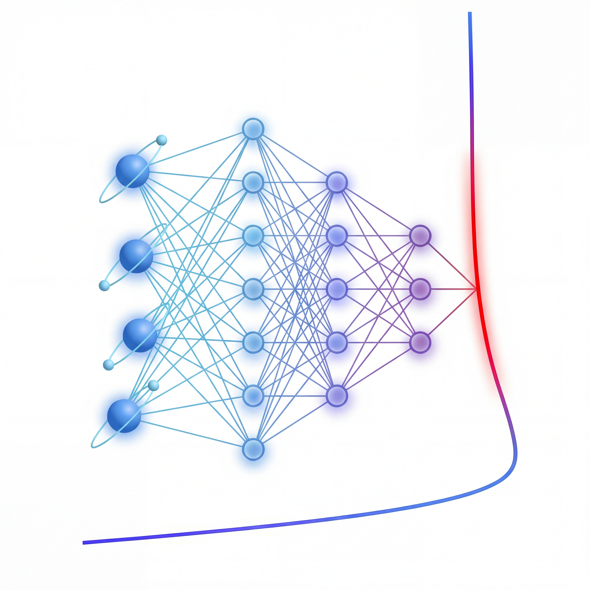

# Hugoniot
<div align="center">
</img>
</div>
<div align="center">
</a>
<a href="https://arxiv.org/abs/2507.18540">

</a>
<a href="https://link.aps.org/doi/10.1103/8zn5-6dnt">

</a>
<a href="https://huggingface.co/datasets/Kelvin2025q/hugoniot">

</a>
<a href="https://github.com/jax-ml/jax">

</a>
<a href="./LICENSE">

</a>
</div>

Variational free energy method source code for hydrogen Hugoniot

## Features

- Pretrain and train models for warm dense hydrogen or deuterium
- Compute equation of state for hydrogen in warm dense matter region
- Visualize results and compute Hugoniot curves

## Installation

Clone this repository and install the dependencies:

```bash
git clone https://github.com/fermiflow/Hugoniot.git
cd Hugoniot
pip install -r requirements.txt
```

Install hqc
```bash
cd hqc
pip install -e .
```

Install cfgmanager
```bash
cd cfgmanager
pip install -e .
```
Then you can train your own hydrogen model.

## Usage

### Pretrain
- Use `pretrainflow.py` to pretrain nucleus flow model.
- Change `config_path` and `config_name` in `pretrainflow.py` l.31 to change the config file to load.
- Change the parameters in config file, like `conf/pretrain/flow/config.yaml`, or override values in the loaded config from the command line to pretrain your model (we use [hydra](https://hydra.cc/) to manage our config files):
```bash
python pretrainflow.py num=16 rs=1.86 T=10000 batchsize=256
```
- Use `folder` parameter to specify the directory to save data and checkpoint files.

### Train
- Use `main.py` to train all of the three neural networks.
- Change `config_path` and `config_name` in `main.py` l.36 to change the config file to load.
- Change the parameters in config file, like `conf/train/config.yaml`, or override values in the loaded config from the command line to pretrain your model.:
```bash
python main.py \
      num=16 \
      rs=1.86 \
      T=10000 \
      batchsize=256 \
      load_pretrain.flow=/your/pretrain/checkpoint/path/epoch_001000.pkl
```
- Use `load_pretrain.flow` parameter to specify the pretrained flow to load (if None, it will train from uniform distribution).
- Use `load` parameter to specify the checkpoint file to load and continue training.
- Use `folder` parameter to specify the directory to save data and checkpoint files.

## Data
Dataset including equation of states, training parameters, network checkpoints, nucleus and electron snapshots are published on [Hugging Face](https://huggingface.co/datasets/Kelvin2025q/hugoniot)

## Citation
If you use this code in your research, please cite our article:
```
@article{8zn5-6dnt,
  title = {Deep variational free energy calculation of hydrogen Hugoniot},
  author = {Li, Zihang, Xie, Hao, Dong, Xinyang, and Wang, Lei},
  journal = {Phys. Rev. Lett.},
  pages = {--},
  year = {2026},
  month = {Jan},
  publisher = {American Physical Society},
  doi = {10.1103/8zn5-6dnt},
  url = {https://link.aps.org/doi/10.1103/8zn5-6dnt}
}
```

## Contributing
Contributions are welcome! 🎉

If you’d like to contribute, open a Pull Request (PR).

## License
This project is licensed under the MIT License. See the LICENSE file for details.
